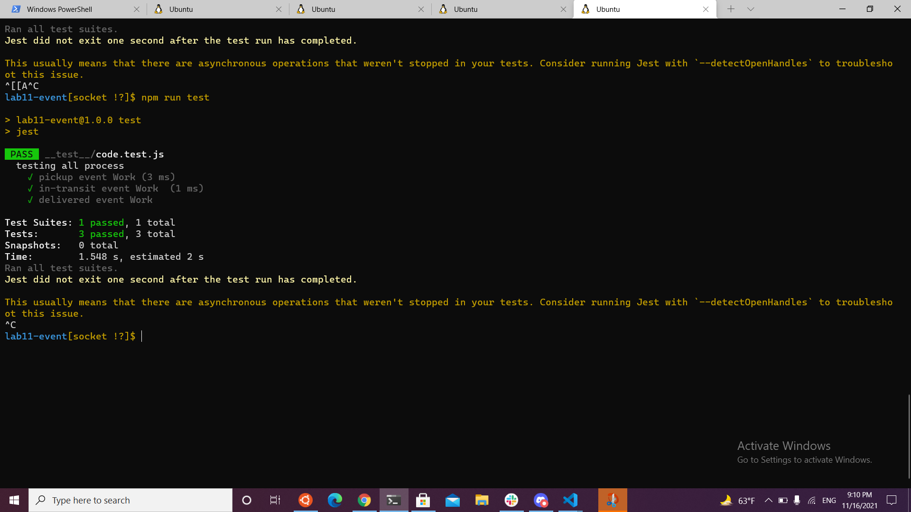

# lab11-event

## action

https://github.com/raneemabujamous/lab11-event/actions

## pull request

https://github.com/raneemabujamous/lab11-event/pulls

## peakage

npm i jest supertest
npm init -y

# lab12-socket

## action

https://github.com/raneemabujamous/lab11-event/actions

## pull request

https://github.com/raneemabujamous/lab11-event/pulls

## peakage

npm i jest supertest socket.io socket.io-client
npm init -y

# lab13-queue

## action

https://github.com/raneemabujamous/lab11-event/actions

## pull request

https://github.com/raneemabujamous/lab11-event/pull/4

## peakage

npm i jest supertest socket.io socket.io-client uuid
npm init -y
